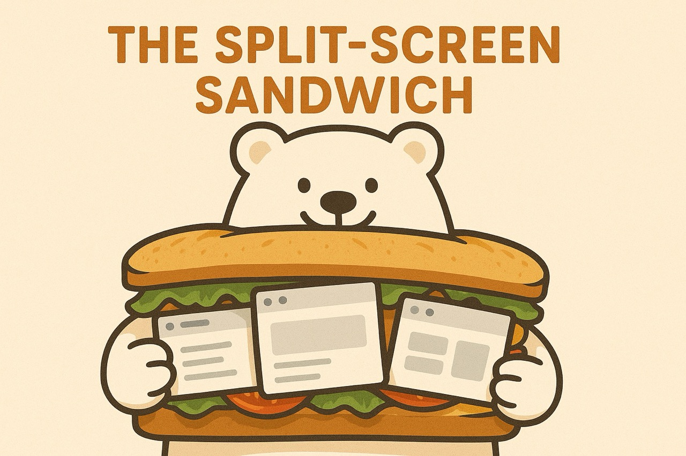

# 🐻‍❄️🥪 Sandwich Bear

A cozy Chrome extension that helps you **create split screen from multiple selected tabs** — neat, customizable, and always handy!

---

## ✨ Features

- 4️⃣ **Tab Splitting**: Open up to 4 tabs in one split screen
- 📐 **Layouts**: Switch between horizontal and vertical views
- ↔️ **Resize & Reorder**: Resize and reorder frames easily
- ➕ **Add New Frame**: Add in new tabs anytime
- ➗ **Group & Detach**: Group tabs into a split screen, or detach them back into tabs
- 🌗 **Dark Mode**: For comfy late-night browsing
- 🔄 **State Restore**: Remembers your split ratios and URLs after reload
- 🔠 **Smart Titles**: Page title follows the active frame

---

## 🚧 Work in Progress

- ⛔ Some sites just won’t load in frames (looking at you, Instagram 👀)
- 🛡️ Ad blocking in frames
- 🛍️ Store release prep

---

## 💡 Note

Sandwich Bear is still baking — expect more features and polish soon!
